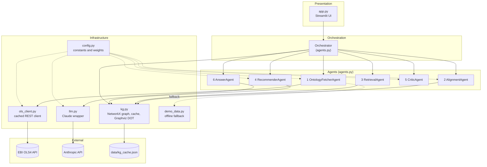
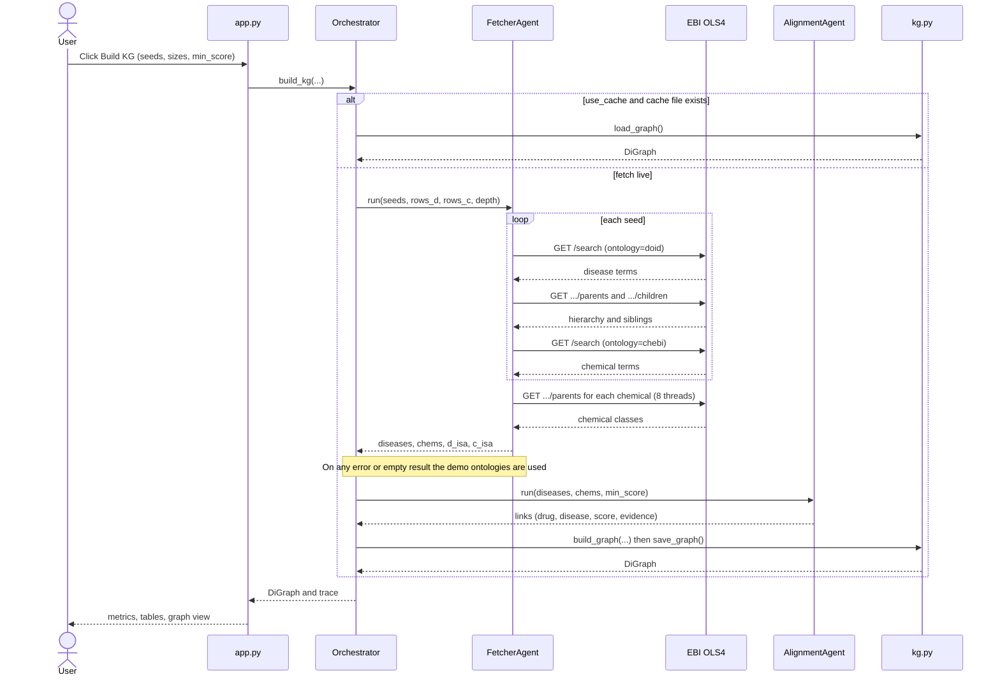
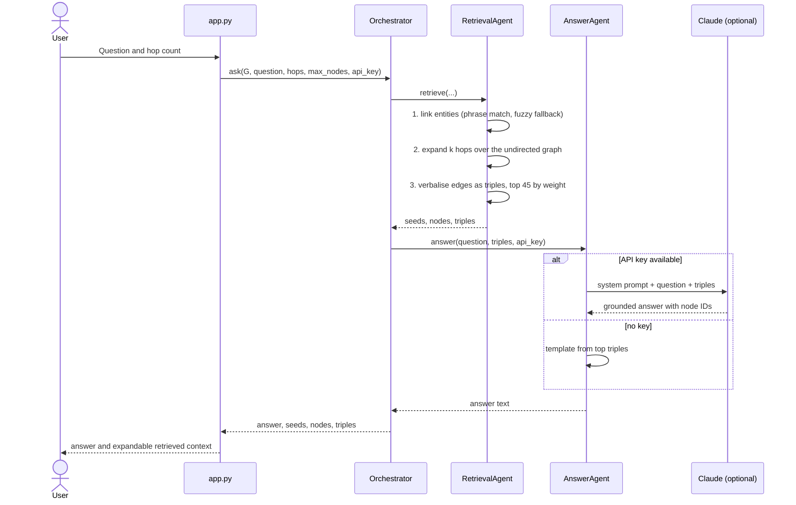
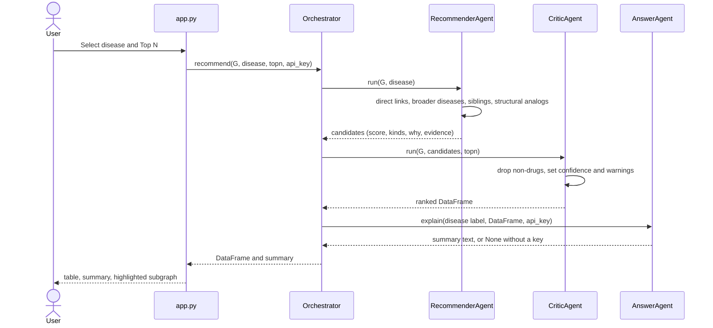
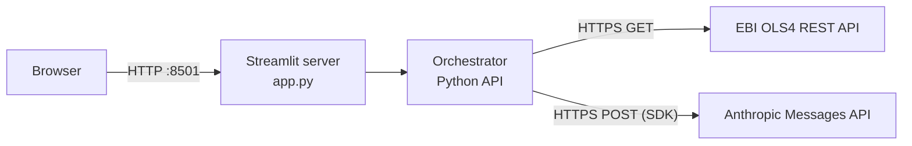
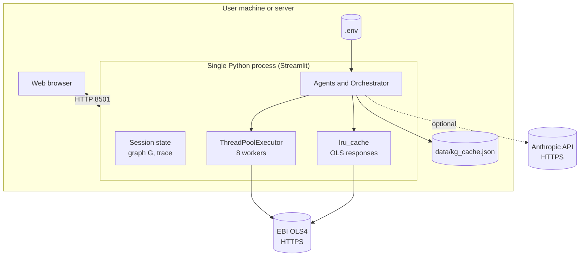

# Technical Document - Ontology-Bridged Drug Repurposing Recommender

| | |
|---|---|
| **Application** | Multi-agent GraphRAG and drug recommendation app |
| **UI framework** | Streamlit |
| **Language** | Python 3.10+ |
| **Data sources** | Human Disease Ontology (DOID), ChEBI - via EBI OLS4 |
| **Optional LLM** | Anthropic Claude (configurable model) |
| **Status** | Research prototype - not for clinical use |

## Contents

1. [Introduction](#1-introduction)
2. [Architecture](#2-architecture)
3. [Data Flow Sequence](#3-data-flow-sequence)
4. [Features](#4-features)
5. [Quick Start](#5-quick-start)
6. [Usage](#6-usage)
7. [API Endpoints Architecture](#7-api-endpoints-architecture)
8. [System Architecture](#8-system-architecture)
9. [Features (Technical and Non-Functional)](#9-features-technical-and-non-functional)
10. [Testing](#10-testing)
11. [License](#11-license)

---

## 1. Introduction

### 1.1 Purpose

The application combines two independent biomedical ontologies into a single knowledge graph and uses that graph for two tasks:

1. **GraphRAG question answering** - answers about diseases and drugs that are grounded only in facts retrieved from the graph, each with an evidence snippet.
2. **Drug recommendation** - ranked drug candidates for a chosen disease, with each candidate labelled as an **established** link or a **repurposing hypothesis**.

### 1.2 The two ontologies

| | Ontology | Provides | Retrieved through |
|---|---|---|---|
| **A** | Human Disease Ontology (**DOID**) | disease terms, synonyms, disease hierarchy | EBI OLS4 REST API |
| **B** | **ChEBI** | chemical/drug terms, textual definitions, chemical-class hierarchy | EBI OLS4 REST API |

The two ontologies share no direct links. The application creates them: an alignment step reads each ChEBI definition (for example "...used for treatment of hypertension") and links the drug to matching DOID diseases, storing the matched text as evidence.

### 1.3 Core idea

```
Disease hierarchy (A)  <--- indicated_for (alignment, scored, with evidence) ---  Drug + chemical classes (B)
```

Repurposing hypotheses come from walking this graph: a drug indicated for a *broader* disease, for a *sibling* disease, or one that shares chemical classes with a drug already linked to the target disease.

### 1.4 Scope and limitations

- Cross-ontology links are derived from text matching, not curated clinical indications. They are hypotheses.
- The graph is a seeded subset of the ontologies, not the full ontologies.
- There is no patient data, dosing, interaction or contraindication logic. This is not medical advice.

---

## 2. Architecture

### 2.1 Component view



### 2.2 Layering rules

| Layer | Modules | Rule |
|---|---|---|
| Presentation | `app.py` | UI only; no business logic; the only module importing Streamlit |
| Orchestration | `Orchestrator` in `agents.py` | sequences agents, handles fallbacks, records the trace |
| Domain | agent classes in `agents.py` | no UI imports; unit-testable offline |
| Infrastructure | `kg.py`, `ols_client.py`, `llm.py` | I/O, graph mechanics, external services |
| Configuration | `config.py`, `.env` | all tunables in one place |

### 2.3 Agent responsibilities

| # | Agent | Input | Output |
|---|---|---|---|
| 1 | **OntologyFetcherAgent** | seed topics, sizes, depth | disease dict (A), chemical dict (B), hierarchy edges; demo fallback |
| 2 | **AlignmentAgent** | A and B nodes, `min_score` | scored `drug -> disease` links with evidence |
| 3 | **RetrievalAgent** | question, graph | linked entities, k-hop subgraph, verbalised triples |
| 4 | **RecommenderAgent** | graph, disease ID | candidate drugs with score, kinds, rationale |
| 5 | **CriticAgent** | candidates, `topn` | filtered, ranked table with confidence and warnings |
| 6 | **AnswerAgent** | triples or ranked table | grounded answer (Claude) or template |

Graph assembly (`kg.build_graph`) is a deterministic step, not an agent.

### 2.4 Knowledge-graph data model

| Node kind | Source | Attributes |
|---|---|---|
| `disease` | Ontology A | `label`, `desc`, `syn`, `onto="A:DOID"` |
| `drug` | Ontology B | `label`, `desc`, `onto="B:ChEBI"` |
| `class` | Ontology B | `label` (a chemical class, i.e. a parent of other ChEBI nodes) |

| Edge | Direction | Attributes |
|---|---|---|
| `is_a` | child to parent, within A and within B | `w = 1.0` |
| `indicated_for` | drug to disease (**cross-ontology**) | `w` (alignment score), `ev` (evidence snippet) |

### 2.5 Key algorithms

**Alignment scoring** (`AlignmentAgent`)

| Evidence | Score |
|---|---|
| disease label or synonym (4+ characters, not generic) found as a phrase in the drug definition | 0.60 |
| therapeutic cue (treat, therapy, used for, inhibitor, ...) within 90 characters of the match | +0.30 |
| the match is the preferred label rather than a synonym | +0.10 |
| fallback: two or more label stems all appear in the definition | 0.55 |

Links below `min_score` (default 0.55) are discarded.

**Recommendation scoring** (`RecommenderAgent`), where `w` is the link weight and `k` the number of hierarchy steps up from the target disease:

| Signal | Label | Score |
|---|---|---|
| drug linked to the target disease | Established (direct) | `w` |
| drug linked to an ancestor, k up to 3 | Repurposing (broader disease) | `w x 0.5^k` |
| drug linked to a sibling disease | Repurposing (related disease) | `w x 0.4` |
| shares chemical classes (up to 2 levels) with a directly linked drug | Structural analog | `0.3 x Jaccard`, best match only, Jaccard above 0.2 |

Signals add up per drug and are capped at 1.0. The **CriticAgent** drops chemicals whose definition matches pesticide, toxin or solvent patterns, and assigns confidence: **High** (established and score 0.85 or above), **Medium** (0.45 or above), otherwise **Low**. Every non-established candidate carries a "hypothesis only" warning.

All weights live in `config.py`.

---

## 3. Data Flow Sequence

### 3.1 Knowledge-graph build



### 3.2 GraphRAG question answering



### 3.3 Recommendation



### 3.4 Data transformations

| Stage | Input | Output | Module |
|---|---|---|---|
| Fetch | seed strings | node dicts `{id, label, desc, syn, onto, iri}` and `(child, parent)` pairs | `ols_client`, `OntologyFetcherAgent` |
| Align | node dicts | `(drug_id, disease_id, score, evidence)` tuples | `AlignmentAgent` |
| Build | nodes, pairs, links | `networkx.DiGraph` | `kg.build_graph` |
| Persist | `DiGraph` | `data/kg_cache.json` (node-link JSON) | `kg.save_graph` |
| Retrieve | question, `DiGraph` | seeds, node set, triple strings | `RetrievalAgent` |
| Score | `DiGraph`, disease ID | candidate dict | `RecommenderAgent` |
| Critique | candidate dict | `pandas.DataFrame` | `CriticAgent` |
| Render | `DiGraph`, node set | Graphviz DOT string | `kg.to_dot` |

---

## 4. Features

### 4.1 Functional features

| Area | Feature |
|---|---|
| **Ontology ingestion** | Live retrieval of DOID and ChEBI through OLS4; seed-driven subset; hierarchy climbing; sibling discovery |
| **Alignment** | Scored drug-to-disease links from definition text; evidence snippet stored per link; adjustable threshold |
| **Knowledge graph** | One unified graph; browsable tables for both ontologies; cross-link table; interactive Graphviz rendering |
| **GraphRAG Q&A** | Entity linking, k-hop expansion, triple verbalisation, grounded answers with node-ID citations; visible retrieved context |
| **Recommendation** | Four evidence signals; established vs hypothesis labelling; confidence level; rationale; evidence; warning column |
| **Agent trace** | Step-by-step log of every agent action |
| **Offline mode** | Bundled demo ontologies; automatic fallback on fetch failure |
| **Caching** | In-process request cache; on-disk graph cache |
| **Optional LLM** | Claude answers and summaries; template fallback when no key is set |

### 4.2 Feature to module map

| Feature | Module |
|---|---|
| Fetch, hierarchy, siblings | `agents.py` (`OntologyFetcherAgent`), `ols_client.py` |
| Alignment | `agents.py` (`AlignmentAgent`), `config.py` (weights) |
| Graph, cache, DOT | `kg.py` |
| Q&A | `agents.py` (`RetrievalAgent`, `AnswerAgent`), `llm.py` |
| Recommendations | `agents.py` (`RecommenderAgent`, `CriticAgent`) |
| UI | `app.py` |

---

## 5. Quick Start

### 5.1 Prerequisites

- Python 3.10 or newer
- Internet access to `www.ebi.ac.uk` (not required for demo mode)
- Optional: an Anthropic API key for LLM-written answers

### 5.2 Windows

```bat
setup.bat      :: one-time: creates .venv, installs requirements, creates .env
run.bat        :: starts the app at http://localhost:8501
```

### 5.3 macOS / Linux

```bash
python3 -m venv .venv
source .venv/bin/activate
pip install -r requirements.txt
cp .env.example .env            # optional: add ANTHROPIC_API_KEY
streamlit run app.py
```

### 5.4 Configuration (`.env`)

| Variable | Default | Purpose |
|---|---|---|
| `ANTHROPIC_API_KEY` | empty | Enables Claude answers and summaries |
| `CLAUDE_MODEL` | `claude-sonnet-5-5` | Model used in `llm.py` |
| `OLS_BASE_URL` | `https://www.ebi.ac.uk/ols4/api` | OLS base URL (use to point at a mirror) |
| `HTTP_TIMEOUT` | `25` | Seconds per OLS request |

### 5.5 Verify the installation

1. Open the sidebar and click **Test OLS4**. A green "HTTP 200" means the live ontologies are reachable.
2. Click **Build KG**. Then open **Agent trace**: lines starting with `[A: DOID]` and `[B: ChEBI]` mean live data was fetched. A line saying "using bundled demo ontologies" means the fetch failed and demo data is in use.
3. Optional: run `python tests/test_smoke.py`.

---

## 6. Usage

### 6.1 Sidebar controls

| Control | Meaning | Default |
|---|---|---|
| Anthropic API key | Enables Claude answers | empty |
| Seed topics | One therapeutic area per line | hypertension, type 2 diabetes mellitus, asthma, rheumatoid arthritis, breast cancer |
| Diseases per seed | DOID search hits kept per seed | 3 |
| Chemicals per seed | ChEBI search hits kept per seed | 15 |
| Hierarchy depth | Parent levels climbed in DOID | 2 |
| Min alignment score | Threshold for cross-ontology links | 0.55 |
| Reuse cached KG | Load `data/kg_cache.json` instead of fetching | off |
| Offline demo mode | Use the bundled mini ontologies | off |

### 6.2 Typical workflow

1. Edit the seed topics, then click **Build KG**.
2. **Ontologies A and B** tab - check which diseases and drugs were fetched.
3. **Knowledge graph** tab - review the cross-ontology links, their scores and evidence snippets.
4. **GraphRAG Q&A** tab - ask a question, then open the retrieved-context expander to see exactly which triples the answer was based on.
5. **Recommend** tab - choose a disease and Top N.
6. **Agent trace** tab - audit what each agent did.

### 6.3 Example questions

- "Which drugs are linked to hypertension and what evidence supports it?"
- "What is the relationship between type 2 diabetes and metformin?"
- "Which diseases is amlodipine linked to?"

Questions must mention a disease or drug that exists in the built graph. If no entity matches, the app says so instead of guessing.

### 6.4 Reading a recommendation

| Column | Meaning |
|---|---|
| Drug, ChEBI | Candidate and its ChEBI ID |
| Score | 0 to 1, sum of evidence signals (capped at 1.0) |
| Type | `Established (direct)`, `Repurposing (broader disease)`, `Repurposing (related disease)`, `Structural analog` |
| Confidence | High, Medium or Low (see section 2.5) |
| Why | Up to three reasons from the graph |
| Evidence | Text snippet from the ChEBI definition |
| Warning | Non-empty for anything that is not an established link |

Illustrative output on the bundled demo data (target: hypertension):

| Drug | Score | Type | Confidence |
|---|---|---|---|
| amlodipine | 1.0 | Established (direct) | High |
| losartan | 1.0 | Established (direct) | High |
| lisinopril | 1.0 | Established (direct) | High |
| metformin | 0.3 | Structural analog | Low |
| pioglitazone | 0.3 | Structural analog | Low |

The last two are hypotheses: they share a demo chemical class with amlodipine, with no direct hypertension evidence.

### 6.5 Programmatic use

The agent layer has no Streamlit dependency. Run from the project folder:

```python
from agents import Orchestrator

orch = Orchestrator()
G = orch.build_kg(["hypertension", "asthma"], rows_d=3, rows_c=15, depth=2, min_score=0.55)

df, summary = orch.recommend(G, "DOID:10763", topn=10)          # hypertension
answer, seeds, nodes, triples = orch.ask(G, "Which drugs treat hypertension?", hops=2, max_nodes=60)

for agent, message in orch.trace:
    print(agent, "-", message)
```

---

## 7. API Endpoints Architecture

The application **does not expose its own HTTP API**. The only inbound interface is the Streamlit web UI. This section documents (a) the external endpoints the app consumes and (b) the internal Python service interface.

### 7.1 Interface overview



### 7.2 External endpoints consumed

**EBI OLS4** - base URL `OLS_BASE` (default `https://www.ebi.ac.uk/ols4/api`). No authentication. Implemented in `ols_client.py`.

| Purpose | Method and path | Key parameters | Response fields used |
|---|---|---|---|
| Term search | `GET /search` | `q`, `ontology` (`doid` or `chebi`), `rows`, `type=class`, `fieldList` | `response.docs[]`: `iri`, `label`, `obo_id`, `short_form`, `description`, `synonym`, `ontology_name` |
| Direct parents | `GET /ontologies/{onto}/terms/{iri}/parents` | `size` | `_embedded.terms[]` |
| Direct children | `GET /ontologies/{onto}/terms/{iri}/children` | `size` | `_embedded.terms[]` |
| Health check | `GET /ontologies/{onto}` | none | HTTP status only |

`{iri}` must be **double URL-encoded** (`ols_client._enc`), for example `http://purl.obolibrary.org/obo/DOID_10763` is encoded twice before being placed in the path.

Example search call:

```
GET /search?q=hypertension&ontology=doid&rows=3&type=class
    &fieldList=iri,label,short_form,obo_id,description,synonym,ontology_name
```

Behaviour:
- `ols_search` raises on HTTP errors; the Orchestrator catches this and switches to demo data.
- `ols_rel` returns an empty tuple on any error or non-200 status, so a missing relative never aborts a build.
- Both functions are memoised with `functools.lru_cache` for the life of the process.
- Request timeout is `HTTP_TIMEOUT` seconds. There is no retry or rate-limit handling.

**Anthropic Messages API** - called through the `anthropic` Python SDK in `llm.py`. Authenticated by API key (sidebar field, or `ANTHROPIC_API_KEY`).

| Item | Value |
|---|---|
| Call | `client.messages.create(model, max_tokens, system, messages)` |
| Model | `CLAUDE_MODEL` (default `claude-sonnet-5-5`) |
| `max_tokens` | 900 |
| System prompt | answer only from the supplied triples, cite node IDs, separate established from hypothetical, state when facts are insufficient, not medical advice |
| User content | the question plus the verbalised triples (Q&A), or the top six ranked rows as CSV (recommendation summary) |
| Failure mode | returns `"(LLM call failed: ...)"` text rather than raising; no key returns `None` and agents use templates |

### 7.3 Internal service interface (Python)

| Method | Parameters | Returns |
|---|---|---|
| `Orchestrator.build_kg` | `seeds`, `rows_d=3`, `rows_c=15`, `depth=2`, `min_score=0.55`, `use_cache=False`, `force_demo=False` | `networkx.DiGraph` |
| `Orchestrator.ask` | `G`, `question`, `hops`, `max_nodes`, `api_key=None` | `(answer: str, seeds: list, nodes: set, triples: list[str])` |
| `Orchestrator.recommend` | `G`, `disease`, `topn`, `api_key=None` | `(DataFrame, summary: str or None)` |
| `Orchestrator.trace` | attribute | `list[(agent_name, message)]` |

Recommendation DataFrame columns: `Drug`, `ChEBI`, `Score`, `Type`, `Confidence`, `Why`, `Evidence`, `Warning`.

### 7.4 Exposing a REST API (extension)

To serve the same capabilities over HTTP, wrap the Orchestrator in a thin service (for example FastAPI). A suggested contract:

| Method and path | Maps to | Request | Response |
|---|---|---|---|
| `POST /kg/build` | `build_kg` | `{seeds, rows_d, rows_c, depth, min_score}` | node and edge counts |
| `POST /ask` | `ask` | `{question, hops}` | `{answer, seeds, triples}` |
| `POST /recommend` | `recommend` | `{disease_id, topn}` | list of ranked rows plus `summary` |
| `GET /health` | `ols_client.ping` | none | `{ok, detail}` |

This is a design suggestion only and is not implemented in the current code.

---

## 8. System Architecture

### 8.1 Runtime and deployment view



### 8.2 State and caching

| State | Scope | Lifetime | Notes |
|---|---|---|---|
| `st.session_state["kg"]`, `["trace"]` | per browser session | until the tab or session ends | held in process memory |
| `lru_cache` on `ols_search`, `ols_rel` | process-wide | until the process restarts | avoids repeat OLS calls for the same arguments |
| `data/kg_cache.json` | disk | until deleted | written after every successful build; the cache key is not tied to seeds or parameters, so **Reuse cached KG** loads whatever was saved last |

### 8.3 Concurrency

- Streamlit reruns the script on every interaction; heavy work is only triggered by buttons.
- Seed search and disease hierarchy calls run sequentially. ChEBI parent climbing runs on a `ThreadPoolExecutor` with 8 workers. `lru_cache` is thread-safe.
- The graph lives in memory per session and is not shared across sessions.

### 8.4 Performance characteristics

| Aspect | Behaviour |
|---|---|
| Build time | dominated by OLS round trips; roughly a few hundred requests for the default settings (an estimate, not measured). Repeat builds in the same process are faster thanks to `lru_cache`. |
| Alignment cost | `O(chemicals x diseases x phrases)` regex searches; fine for hundreds of nodes |
| Retrieval | BFS bounded by `hops` and `max_nodes` (60); only the top 45 triples go to the LLM |
| Memory | NetworkX graph in RAM; suitable for thousands of nodes |
| Scaling path | move the graph to a graph database (for example Neo4j) and serve through an API layer |

### 8.5 Reliability and error handling

| Failure | Behaviour |
|---|---|
| OLS search fails or returns nothing | automatic fallback to demo ontologies; recorded in the trace |
| OLS relative lookup fails | returns empty; the build continues |
| No API key | template answers from the top triples |
| LLM call raises | error text returned in the answer; app stays up |
| Cache write fails | logged to the trace; ignored |
| Question matches no entity | explicit "no entities matched" message |

### 8.6 Security and privacy

- The API key is entered in a password field or read from `.env`. It is not written to disk by the app, and `.env` is excluded by `.gitignore`.
- Outbound traffic goes only to OLS4 and, if a key is set, the Anthropic API.
- Data sent to the LLM is limited to the user question and ontology-derived text.
- Streamlit serves on `localhost:8501` by default; put it behind authentication and TLS before exposing it to others.

### 8.7 Technology stack

| Concern | Choice |
|---|---|
| UI | Streamlit (`st.graphviz_chart` for graphs) |
| Graph | NetworkX `DiGraph` |
| Tabular data | pandas |
| HTTP | requests |
| LLM | anthropic SDK |
| Configuration | python-dotenv and `config.py` |
| Tests | pytest or plain Python |

---

## 9. Features (Technical and Non-Functional)

| Category | Characteristic |
|---|---|
| **Modularity** | seven modules with one responsibility each; UI separated from agent logic |
| **Testability** | agents run offline without Streamlit; bundled demo ontologies; smoke tests |
| **Explainability** | every link carries an evidence snippet; every recommendation carries a rationale; the retrieved context and the agent trace are visible |
| **Grounding** | the LLM prompt restricts answers to retrieved triples and requires node-ID citations |
| **Graceful degradation** | works with no network (demo mode) and with no API key (template answers) |
| **Configurability** | thresholds, weights and endpoints in `config.py` and `.env`; adjustable from the sidebar |
| **Transparency of uncertainty** | established links and hypotheses are labelled, scored, given a confidence level and a warning |
| **Portability** | pure Python; Windows scripts (`setup.bat`, `run.bat`) and cross-platform commands |
| **Extensibility** | new agents or evidence signals can be added without touching the UI; see the extension ideas below |
| **Resilience** | memoised requests, thread-pooled chemical lookups, tolerant error handling |

### Extension ideas

- Replace or augment lexical alignment with biomedical embeddings (for example SapBERT) and OLS cross-references.
- Add curated evidence sources (DrugBank, ChEMBL, DrugCentral) as a further layer.
- Add a literature-validation agent (PubMed) for repurposing hypotheses.
- Add contraindication and interaction checks to the Critic.
- Key the graph cache on seeds and parameters.
- Expose the Orchestrator as a REST API (section 7.4).

---

## 10. Testing

### 10.1 Running the tests

```bash
python tests/test_smoke.py     # plain Python
pytest                         # alternative (pytest is in requirements.txt)
```

The tests run offline, need no API key, and use the bundled demo ontologies.

### 10.2 Current automated tests (`tests/test_smoke.py`)

| Test | Verifies |
|---|---|
| `test_alignment_creates_links` | the demo graph contains both `is_a` and `indicated_for` edges |
| `test_recommend_established_and_hypothesis` | for hypertension: amlodipine is `Established (direct)`; metformin is a `Structural analog` carrying a warning |
| `test_graphrag_retrieval` | the question "Which drugs treat type 2 diabetes?" links to `DOID:9352`, retrieves a triple containing metformin, and the template answer mentions it |

### 10.3 Coverage and gaps

| Area | Automated | Notes |
|---|---|---|
| Alignment, recommendation, retrieval logic | Yes (demo data) | small fixture; thresholds are not exhaustively tested |
| Critic filtering of non-drugs | No | add a fixture containing a pesticide-style definition |
| OLS4 client against the live service | No | needs network; verify manually with **Test OLS4** and the Agent trace |
| LLM path | No | requires a key; the template path is what the tests exercise |
| Streamlit UI | No | verify manually; Streamlit's `AppTest` is an option |
| Cache save and load | No | add a round-trip test with `kg.save_graph` and `kg.load_graph` |

### 10.4 Manual test checklist

1. Click **Test OLS4** - expect a green HTTP 200.
2. Build with the default seeds - the Agent trace shows `[A: DOID]` and `[B: ChEBI]` lines and a non-zero link count.
3. In **GraphRAG Q&A**, ask about a seeded disease - the answer cites node IDs and the context expander lists triples.
4. In **Recommend**, pick a seeded disease - established rows have High or Medium confidence, other rows carry a warning.
5. Tick **Offline demo mode** and rebuild - the app still works.
6. Remove the API key - answers fall back to bullet lists without errors.

### 10.5 Suggested additions

- Mock OLS4 responses (for example with `responses` or `requests-mock`) to test the fetcher and the double-encoding.
- Parametrised alignment tests for negation and generic-term edge cases.
- A regression fixture of known drug-disease pairs to track precision as the alignment evolves.

---

## 11. License

### 11.1 This project

The project is released under the **MIT License** (see the `LICENSE` file). Replace the copyright holder in `LICENSE` with your own name or organisation. If you need a different licence, replace the file and update this section.

### 11.2 Third-party data and services

| Resource | Licence or terms | Note |
|---|---|---|
| Human Disease Ontology (DOID) | CC0 1.0 (public domain dedication) | verify on the ontology's page before redistribution |
| ChEBI | CC BY 4.0 | attribute ChEBI/EMBL-EBI if you redistribute derived data |
| EBI OLS4 service | EMBL-EBI terms of use | fair-use access; respect rate limits |
| Anthropic API | Anthropic commercial terms | use is subject to your account agreement |
| Python dependencies | their own open-source licences | see each package |

The cached graph in `data/kg_cache.json` contains ontology-derived text; apply the data licences above if you share it.

### 11.3 Disclaimer

This software is a research prototype provided "as is". Its outputs are computational hypotheses derived from text and are not medical advice, diagnosis or treatment recommendations.
