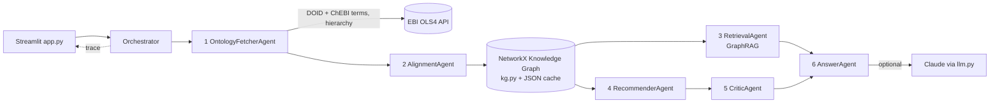

# Design - Ontology-Bridged Drug Repurposing Recommender

## 1. Goal

Combine two independent biomedical ontologies into one knowledge graph and use it for
(a) evidence-grounded question answering (GraphRAG) and (b) drug recommendation that
distinguishes **established** indications from **repurposing hypotheses**.

## 2. Architecture

Layering: `app.py` (UI only) → `agents.py` (logic, no Streamlit imports) → `kg.py`,
`ols_client.py`, `llm.py` (infrastructure) → `config.py` (constants).

## 3. Ontologies

| | Source | Used for |
|---|---|---|
| A | DOID via OLS4 | disease nodes, synonyms, `is_a` hierarchy, siblings |
| B | ChEBI via OLS4 | chemical nodes with textual definitions, chemical-class `is_a` hierarchy |

Seeds (e.g. "hypertension") drive retrieval: DOID search returns diseases; ChEBI full-text
search over definitions returns chemicals that mention the topic. Parents are climbed
(`depth` levels for DOID, 2 for ChEBI); siblings come from the children of a disease's first parent.
Any ChEBI node that is a parent of another becomes a `class` node.

## 4. Knowledge-graph data model

| Node kind | Source | Attributes |
|---|---|---|
| `disease` | A | label, desc, syn |
| `drug` | B | label, desc |
| `class` | B | label (chemical class) |

| Edge | Direction | Attributes |
|---|---|---|
| `is_a` | child → parent (within A, within B) | `w=1.0` |
| `indicated_for` | drug → disease (**cross-ontology**) | `w` (score), `ev` (evidence snippet) |

## 5. Agents

| # | Agent | Input | Output |
|---|---|---|---|
| 1 | OntologyFetcherAgent | seed topics, sizes | disease/chemical dicts + hierarchy edges (demo fallback offline) |
| 2 | AlignmentAgent | A & B nodes | scored drug→disease links with evidence |
| 3 | RetrievalAgent | question, graph | linked entities, k-hop subgraph, verbalised triples |
| 4 | RecommenderAgent | graph, disease | candidate drugs with scores and rationale |
| 5 | CriticAgent | candidates | filtered ranked table with confidence and warnings |
| 6 | AnswerAgent | triples / ranked table | grounded answer (Claude) or template |

The **Orchestrator** sequences the agents, handles fallbacks (OLS failure → demo data), caches the
graph in `data/kg_cache.json`, and records a `(agent, message)` trace shown in the UI.
Graph assembly (`kg.build_graph`) is a deterministic step, not an agent.

## 6. Alignment algorithm

For each drug definition `d` and disease `x` (label + synonyms ≥ 4 chars, excluding generic words):

| Evidence | Score |
|---|---|
| phrase of `x` found in `d` | 0.60 |
| + therapeutic cue (treat, therapy, used for, inhibitor, …) within ±90 chars | +0.30 |
| + match is the preferred label (not a synonym) | +0.10 |
| fallback: all ≥2 stems of the label appear in `d` | 0.55 |

Links below `min_score` are discarded. The evidence window is stored on the edge and surfaced
in the UI and in LLM context. Stemming uses the first 6 letters ("hypertensive" ≈ "hypertension").

## 7. GraphRAG flow

1. **Entity linking** - phrase match of labels/synonyms in the question; fuzzy fallback on stem
   coverage (≥ 50 %), ranked by overlap; top 3 seeds.
2. **Expansion** - undirected BFS for `hops` levels, capped at `max_nodes`, high-degree nodes first.
3. **Verbalisation** - each edge becomes a triple line; `indicated_for` lines include score and
   evidence; sorted by weight, top 45 kept.
4. **Generation** - Claude is instructed to answer only from the triples, cite node IDs, separate
   established vs hypothetical, and admit insufficiency. No key → top triples are shown.

## 8. Recommendation scoring

Let `w` be an `indicated_for` weight, `k` the number of hierarchy steps up from the target disease.

| Signal | Label | Score |
|---|---|---|
| drug linked to target | Established (direct) | `w` |
| drug linked to ancestor at distance k ≤ 3 | Repurposing (broader disease) | `w · 0.5^k` |
| drug linked to a sibling disease | Repurposing (related disease) | `w · 0.4` |
| drug shares chemical classes (≤2 levels up) with a directly-linked drug | Structural analog | `0.3 · Jaccard` (best match only, Jaccard > 0.2) |

Signals add up per drug and are capped at 1.0. **Critic rules:** drop chemicals whose definition
matches pesticide/toxin/solvent patterns; confidence = High (established and score ≥ 0.85),
Medium (score ≥ 0.45), otherwise Low; any non-established candidate carries a
"hypothesis only" warning. Weights are in `config.py`.

## 9. Error handling

- OLS network/HTTP errors on relatives return empty tuples; search errors trigger demo fallback.
- Missing API key → template answers; LLM exceptions are returned as a message, not raised.
- Cache write failures are logged to the trace and ignored.

## 10. Limitations

- Alignment is lexical: negations ("not used for…"), adverse effects and mechanism text can
  create false links. Links are hypotheses, not curated indications.
- ChEBI is chemistry-oriented and does not model indications; coverage depends on definition text.
- Chemical-class similarity is a coarse proxy for pharmacology.
- OLS-backed graph is a seeded subset, not the full ontologies.
- No patient data, dosing, interactions or contraindications - not for clinical use.

## 11. Extension ideas

- Replace/augment lexical alignment with biomedical embeddings (e.g. SapBERT) and OLS/UMLS xrefs.
- Add curated sources (DrugBank, ChEMBL, DrugCentral) as a third ontology/evidence layer.
- Add a literature-validation agent (PubMed) for repurposing hypotheses.
- Add contraindication/interaction checks to the Critic.
- Swap NetworkX for Neo4j when the graph outgrows memory.

## 12. Testing

`tests/test_smoke.py` runs offline on demo data and checks: links are created; hypertension yields
established drugs plus a structural-analog hypothesis with a warning; GraphRAG links
"type 2 diabetes" to DOID:9352 and retrieves metformin.
